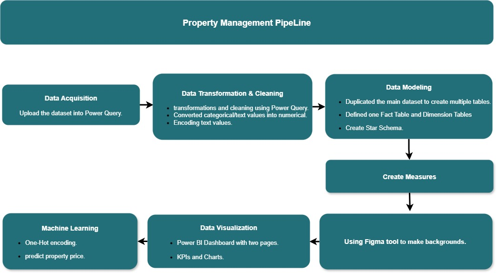

# Property Management Data Analysis & Machine Learning Project
Real estate data analytics project combining Power BI dashboard, data warehouse modeling and Machine Learning to generate actionable insights.

---

## Overview
This project presents an end-to-end Data Analytics and Machine Learning pipeline for real estate management. It covers data cleaning, and transformation, data warehouse modeling, interactive dashboard design in Power BI, and predictive modeling in Python. The main objective is to convert raw data into business insights and accurate property price forecasts.

---

## Project Pipeline

1. **Data Acquisition**
   - Uploaded the dataset into Power Query.

2. **Data Transformation & Cleaning**
   - Applied transformations and cleaning in Power Query.
   - Converted categorical/text values into numerical.
   - Handeling missing values.
   - Encoded text values.

3. **Data Modeling**
   - Duplicated the main dataset to create multiple tables.
   - Defined one Fact Table and several Dimension Tables.
   - Created a **Star Schema**.

4. **Create Measures**
   - Defined KPIs and calculated measures in Power BI.

5. **Using Figma to design custom backgrounds.**

6. **Data Visualization**
   - Designed a **Power BI dashboard with two pages**.
   - Included KPIs, charts, and visual insights.

7. **Machine Learning**
   - Applied One-Hot Encoding for categorical features.
   - Built a predictive ML model in Jupyter Notebook to forecast property prices.
   - Using RandomForest Regressor.

---

## Features
- **End-to-end project** (Extract, Transform, Load).
- **Star Schema modeling**.
- **Interactive dashboard** in Power BI.
- **Machine Learning integration** for predictive analytics.
- **Custom UI** elements designed in Figma.

---

## Project Structure

Project/
├── pipeline.jpg
├── Images/
│   ├── DWH.PNG
│   ├── Dashboard_Page1.PNG
│   ├── Dashboard_Page2.PNG
│   └── PipeLine.PnG
├── PowerBI/
│   └── Property Management Dashboard
├── ML_Model/
│   ├── Housing dataset - Copy(2).xlsx 
│   └── Real_Estate_ML.pbix
└── README.md
